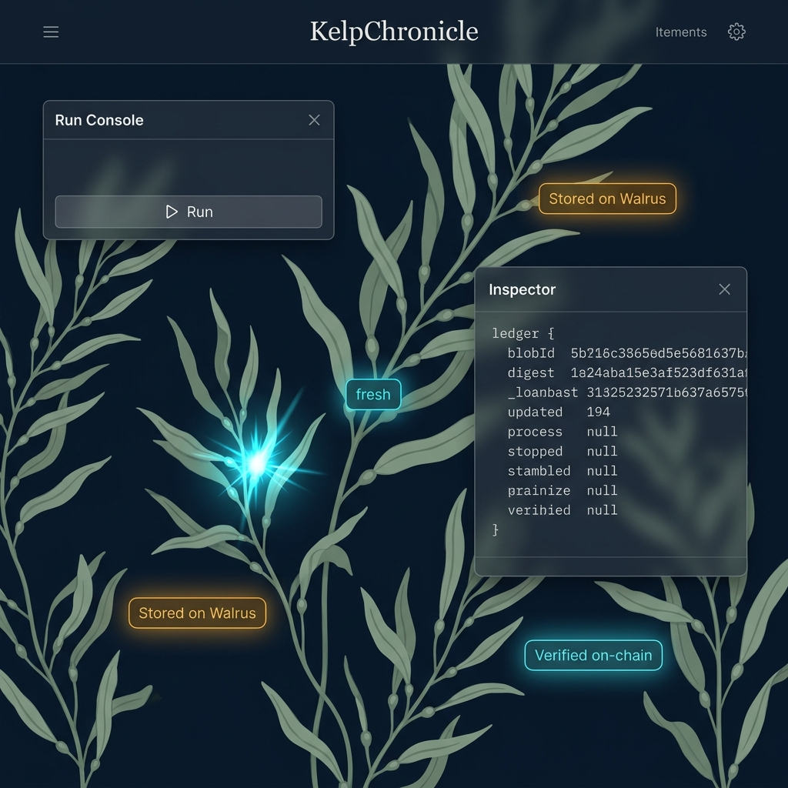

# Frontend UI Design Spec — KelpChronicle (Task 11+)

> Status: Approved direction (2026-06-21). Branding per `2026-06-20-branding-design.md` (KelpChronicle / kelp-forest). API shapes per `backend/src/routes.ts` + `shared/src/artifact.ts`.
> Scope: the dApp frontend (Tasks 11–14 surface). Backend endpoints already shipped (Task 10).



> Mockup = **aesthetic target** for the *procedural* renderer, NOT a static background asset. The lush kelp must be drawn programmatically from data (see §3 — "Procedural Seaweed"). The Inspector's ledger fields in the image (`process/stopped/stambled/…`) are AI filler — real fields are runId / blobId / digest / epoch / relevance (§2).

---


## 1. North Star & Architecture

**Demo killer:** "Close the app / switch devices — the memory is still there, restored from Walrus."

Two demo modes, one architecture:
- **① Clear local view** — frontend-only visual reset (hides nodes). Safe, stage-controlled opener. Proves *nothing* about persistence by itself.
- **② Cross-device / incognito** — the real GTM proof. A fresh client fetches `/memory` and the whole forest regrows. This is the target.

**Golden rule that makes ② nearly free:**

> The graph state is ALWAYS a pure projection of the server's `/memory` response. The frontend NEVER persists run/finding data to localStorage. localStorage holds ONLY UI prefs (panel layout).

Consequences:
- ② works with zero extra data work — a new client has no local memory to cheat with; it must fetch from the server, whose truth lives in Walrus + on-chain attestation.
- Harder proof available: wipe the backend cache too (restart) → `/restore` rebuilds from Walrus → ② proves "survives device swap AND backend amnesia."
- ① degrades to a frontend toggle layered on top of ②.

**Stack:** Vite + React 19 + `@mysten/dapp-kit-react` 2.x + `@tanstack/react-query` + `@mysten/sui` `SuiGrpcClient` (testnet) + `d3-force` (approved new dep). Single-page SPA. Full-bleed canvas底 + floating glass HUD windows on top.

**Data layer (plan Task 11):** `frontend/src/lib/api.ts` → `api.run(topic, agent)` / `api.getMemory(topic)` / `api.restore()`. `BASE = import.meta.env.VITE_BACKEND ?? 'http://localhost:8788'`.

**Memory truth source:** `useQuery(['memory', topic])` is the single source. The graph is `projectGraph(artifacts)` — a pure function — never independent state.

---

## 1.5 Visual Language (frontend-design review, 2026-06-21)

Direction: **Botanical Deep-Sea Chronicle** — a living field journal / herbarium, NOT a neon sci-fi aquarium. Keeps the branding spec's core metaphors (kelp forest, seabed anchoring, growth animation, two trust badges) but corrects three AI-slop traps surfaced in review: generic fonts, undisciplined glow, flat glass.

**Typography (Inter is banned):**
- Display: **Fraunces** (italic, optical-sizing axis — organic softness echoes kelp; serves the *Chronicle* concept). Used for logo, headings, empty-state copy.
- Data / ledger: **Spline Sans Mono** — all on-chain/Walrus data (blobId, attestation digest, epoch, relevance, runId) renders monospace for "scientific ledger" credibility. Also used for eyebrows/labels.

**Palette (herbarium, not radioactive) — lock these:**
```
--abyss:    #05090c   /* background base */
--abyss2:   #0e2026   /* deep-teal depth gradient */
--kelp:     #5f8f6e   /* anchored memory nodes (matte, desaturated) */
--kelp-lit: #7fb894   /* display-italic accent */
--herb:     #8aa38f   /* secondary botanical text */
--amber:    #d9a441   /* Stored on Walrus — warm bioluminescence */
--cyan:     #3fd6e8   /* the SINGLE sharp spark: Verified on-chain + fresh delta */
```

**Glow economy (the key discipline):** glow is *earned*, not ambient.
- Only two elements glow: `Stored on Walrus` (amber) and `Verified on-chain` / fresh-delta finding nodes (cyan).
- Everything else — known kelp nodes, recalled-status chips, panels, text — is **matte**. This is what makes the verification moment pop instead of mushing into uniform neon.

**Atmosphere over flat glass:** abyssal radial-gradient background + subtle SVG grain overlay (≈0.5 opacity, overlay blend) + one slow drifting caustic light cone (14s ease loop) + slow upward-drifting abyssal marine snow particles (low opacity `0.05 - 0.1` floating snow to add a breathing environment). HUD panels use restrained `blur(3px)` glass, not heavy frosted glass.

**Motion budget:** spend it on the signature biological growth animation and the fluid current sway physics on the main canvas, ensuring the entire kelp forest feels alive.

Reference style tile: `.superpowers/brainstorm/*/content/style-tile.html` (not committed — gitignored). Palette/fonts above are the source of truth.

---

## 2. Layout — A: Full-bleed Canvas + Windowed HUD

The kelp-forest canvas fills the viewport. Control surfaces are independent glass windows over it, each with: drag handle, resize corner, collapse button. Position/size persisted to localStorage key `recall_panels`. Default layout: Console top-left, Inspector right, Memory/Restore bottom-left — user can move/resize/collapse freely so panels never block the graph.

Top bar (minimal): `KelpChronicle` logo + dapp-kit `ConnectButton`.

| Window | Content | Source |
|---|---|---|
| **Kelp Canvas** (full-screen base) | Force-directed kelp forest. Trunk = run, bud = finding. Fresh findings pulse cyan. | `/memory` projection |
| **Run Console** (default top-left) | topic input; agent = connected wallet address (read-only display); ▷ Run button; after run shows `+N fresh · M known`. | `api.run` |
| **Inspector** (default right; opens on node click) | Trunk node → runId / blobId / attestation digest + `Stored on Walrus ◈` / `Verified on-chain ✓ ↗`. Bud node → finding title / summary / sourceUrl ↗. | projected node data |
| **Memory / Restore** (default bottom-left) | recall list (run #, finding count); **Clear local view** (①); **Restore from Walrus** (②); QR code (scan to open same namespace on phone). | `api.restore` + `getMemory` |

Explorer link format: `https://testnet.suivision.xyz/txblock/{attestationDigest}` (suiscan acceptable alt).

---

## 3. Graph Semantics & Engine

**Model (two-tier):**
- **Trunk node = run** (one per `runId`), anchored at the "seabed". Carries `blobId` + attestation digest → hover/inspect shows on-chain verification.
- **Bud node = finding**, grows off its parent run node. Carries `title / summary / sourceUrl` (by finding `key`).
- **Edges:** run → its findings (membership); run → prior runs via `priorRunIds` (lineage trunk growing upward over generations).
- **Fresh vs known:** this run's delta findings (cyan, glowing pulse); known findings reuse existing nodes.

**Engine:**
- Layout via `d3-force` (+ `d3-quadtree`); rendered on a 2D `<canvas>` (stable >50 nodes vs SVG/DOM; demo stays smooth). Chosen over react-flow (a node-editor — fighting it for generative-art styling costs more than it saves).
- **Procedural Seaweed — "data IS the kelp" (decision 2026-06-21):** there is NO static painted background. Every visible kelp strand is a run; every bud is a finding; the whole forest is drawn programmatically from the `/memory` projection so growth maps 1:1 to data (matches branding spec: "force-directed graph *styled to look like* seaweed"). To approach the mockup's density, each stem bezier renders procedural fronds/leaves along its length (instanced leaf sprites or parametric curves), count scaling with the run's finding count. **This is the primary art risk** — if procedural lushness underwhelms in the demo, fallback = increase frond density + hand-tuned SVG leaf sprites instanced along stems (still data-driven, no decorative-only layer). Atmosphere layers (grain, caustic cone, marine snow) remain non-data ambiance behind the kelp.
- **Fluid Current Sway (洋流動力學)**: The entire kelp stem structure is dynamic. The canvas animation loop applies a sine wave sway function (`y_sway = Math.sin(time * frequency + node_depth * phase_offset) * amplitude`) to the bezier control points. Nodes attached further up the branch (shallower depth) lag behind the base, creating a natural, fluid wave propagation along the seaweed.
- **Interactive Mouse Sway (滑鼠力場微幅搖擺)**: The mouse cursor position $(x_m, y_m)$ represents a subtle local current. The cursor remains standard/default with no flashy particles or large visual effects. When the mouse moves, nodes and kelp stem control points within a radius of 120px experience a highly-dampened, gentle offset (`offset = (1 - distance/120) * 0.15 * max_offset * sin(time)`). This makes the seaweed sway dynamically on hover, but keeps nodes stable enough for easy user interaction (hover & click) without the nodes "fleeing" from the pointer.
- **Budding Growth (孢子綻放生長)**: When new delta findings are rendered:
  1. Stems (tendrils) grow outward using path length interpolation (dasharray style).
  2. New bud nodes scale up from `0` to `1` using an elastic easing function (`cubic-bezier(0.34, 1.56, 0.64, 1)`).
  3. A temporary bioluminescent pulse surges into the new node, lighting it up to `cyan-spark` while older nodes fade smoothly into matte kelp green.
- **Memory Retrieval Pulse (流光脈衝)**: When `recall` is triggered, a packet of light (a small glowing arc/dot) travels from the root seabed run node up the curved stem bezier path to the target node, visualising the data retrieval.
- **Exit (① Clear)**: Nodes smoothly retract back along their parent stems toward the seabed and fade (`opacity -> 0`).
- **Interaction**: Hover triggers a gentle node expansion + mini-tooltip (showing epoch, relevance, blobId); click opens the right-hand Inspector.

---

## 4. State & Error Handling (red-team)

- **Run in progress:** single-flight. Disable Run button locally; backend 409 → toast "a run is already in progress".
- **Backend 502** (memory/agent service error) → non-destructive toast; graph keeps current state (never blanks).
- **No wallet connected:** Run disabled, prompt to connect.
- **Empty memory** (first load / pre-restore) → seabed empty state: "No anchored memory yet — run the agent."
- **topic > 200 chars:** blocked client-side (mirrors backend `TOPIC_MAX`).
- **react-query throttling** (lesson 2026-06-07 / 429): high `staleTime`, `refetchOnWindowFocus: false`, limited retry + backoff. Compute request amplification before adding any auto-refetch/polling.
- Single-wallet trap (lesson 2026-06-10): demo uses `agent = connected wallet address`; the on-chain signer is the backend `RECALL_SIGNER_KEY`, NOT the wallet. Spec-noted: agent ≠ signer. Not trustless — honesty-badge wording only (Stored on Walrus / Verified on-chain / Persists across sessions).

---

## 5. Testing Strategy

- **Pure projection extracted:** `frontend/src/lib/projectGraph.ts` — `Artifact[] → { nodes, edges }`. node:test unit tests (no IO/env import-chain side effects, lesson 2026-06-10). Tests encode WHY: delta maps to fresh-flagged buds; `priorRunIds` lineage produces trunk edges (no dropped edges); empty input → empty graph; duplicate finding `key` across runs reuses one node.
- **API client:** fetch-mocked happy / 409 / 502 branches.
- **Graph rendering/animation:** visual, not unit-tested. Manual + monkey test: hammer Run, drag panels off-screen, resize to minimum, rapid node clicks, run with empty/huge memory.

---

## 6. Out of Scope (this spec)

- Endpoint auth / rate-limit / per-agent scoping (DECISIONS Task 10 must-fix; public-deploy gate, not demo).
- Live `/run` happy-path (blocked on MemWal account + `RECALL_SIGNER_KEY`).
- Multi-agent shared namespace UI.
